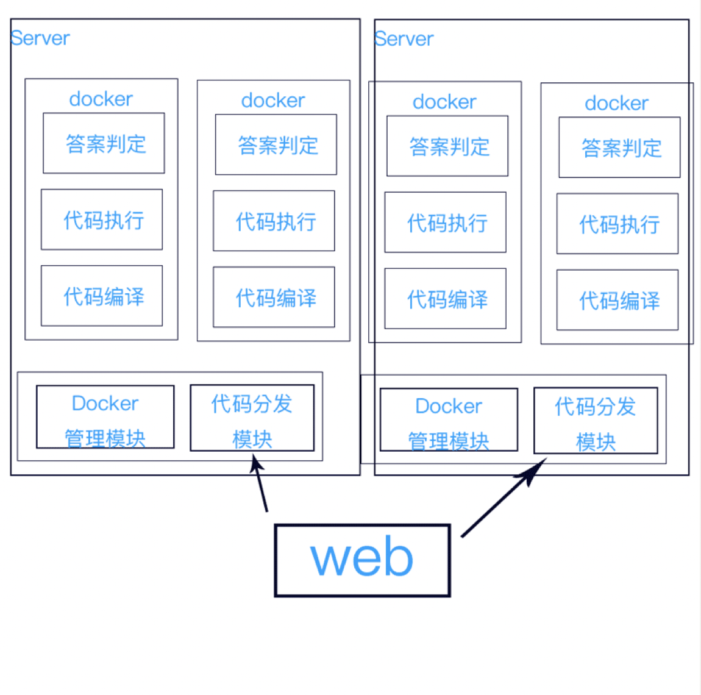

# ZTOJ
ZT Online Judge 公開版

# 注意：此版本仅为作业版本，正式开源版本将于2019年2月份开源，敬请期待。


## 基于Docker 的在线评测系统

**在线评测系统**（英语：**Online Judge**，缩写**OJ**）是一种在编程竞赛中用来评测参赛程序的在线系统，也可以用于平时练习。 --取自[维基百科](https://zh.wikipedia.org/zh-cn/在线判题系统)

一个Online Judge 平台主要分为两个部分：用户使用模块(包括但不限于: 试题库、提交代码、排名展示等)、评测模块(包括但不限于: 判定队列模块、判定模块)。由于整个系统的核心技术应集中于 **判定模块**。故应以判定模块的可靠性、稳定性和效率来作为整个Online Judge 的主要评测参数。鉴于用户上传的代码数据(当然也包括其他的数据)是不可信任的，它不被排除会出现恶意代码，所以我们应当采用一定的手段对将被执行的程序进行处理。这里的手段包括很多，例如沙箱(Sandbox)、代码黑名单、危险函数过滤等。但是由于黑名单机制和危险函数的过滤机制存在本身的不健全机制，故我们在此使用沙箱进行代码运行保护。

## 仓库说明
本仓库的项目为河北师范大学专用 OJ 平台

项目仓库分为两个主分支

develop 开发分支，所有开发将在此分支下进行，如无严重或重大问题，分支将并入master

master 主项目分支

## 开发人员
佐鑫 土豆豆

## 文档撰写
陈锐

## 项目进度

| 序号 | 项目进度 |  时间/周期   | 参与开发人员 |
| :--: | :------: | :----------: | :----------: |
|  1   | 项目开始 | 2018年5月5日 | 土豆豆  佐鑫 |
| 2    | 前端项目修正负责人 | 2018年5月18日 | 佐鑫 |
| 3    | 项目开始 | 2018年5月5日 | 土豆豆  佐鑫 |
|4|用户前端基本完成 | 2018年5月11日 | 土豆豆 佐鑫|
|5|数据库设计 | 2018年5月11日 | 土豆豆 佐鑫|
|6|管理员界面开始编程 | 2018年5月12日 | 土豆豆|
|7|Docker开始编程 | 2018年5月12日 | 土豆豆|
|8|初步完成Django异步框架嵌入 | 2018年5月13日 | 土豆豆|
|9|前端项目修正负责 | 2018年5月18日 | 佐鑫|
|10|续2018年5月13日 完善全部页面，包括管理员登陆页面，出题发布页面，用户管理等页面，完善Web逻辑|
|11|前端与中间件接口文档上传 | 2018年5月18日 | 土豆豆|
|12|数据库调整和完善 | 2018年5月20日 | 佐鑫|
|13|注册登录功能、创建问题功能测试跑通 | 2018年5月23日 | 佐鑫|
|14|更新接口文档和上传判题核心 | 2018年5月28日 | 土豆豆|
|15|皮 | 2018年5月28日-6月8日 |
|16|接着皮| 2018年6月9日 | 土豆豆|
|17|完善web服务| 2018年6月10日 | 土豆豆|
|18|各页面问题列表、比赛列表连通数据库| 2018年6月10日 | 佐鑫|
|19|更新web服务judge服务，更新docker| 2018年6月10日 | 土豆豆|
|20|问题测试样例功能| 2018年6月13日 | 佐鑫|
|21|修正web服务一个致命错误| 2018年6月13日 | 土豆豆|
|22|添加比赛的总排行榜、结束时间| 2018年6月15日 | 土豆豆、佐鑫|


### 沙箱保护的方面

#### 系统及程序资源的保护

基本评测系统应考虑程序的运行资源，例如：运行时间、运行内存、进程数量、线程数量。由于我们采用Linux开发OJ系统，那就应该充分利用Linux的工具开发，故选择使用` ulimit`，使用说明如下

```shell
ulimit -t 10 -v 10240
# 执行命令，限时10s，内存限制 10240k 。
```

>详细说明
>
>| 命令参数 | 描述                                                     | 例子                                                         |
>| -------- | -------------------------------------------------------- | ------------------------------------------------------------ |
>| -H       | 设置硬资源限制，一旦设置不能增加。                       | ulimit – Hs 64；限制硬资源，线程栈大小为 64K。               |
>| -S       | 设置软资源限制，设置后可以增加，但是不能超过硬资源设置。 | ulimit – Sn 32；限制软资源，32 个文件描述符。                |
>| -a       | 显示当前所有的 limit 信息                                | ulimit – a；显示当前所有的 limit 信息                        |
>| -c       | 最大的 core 文件的大小， 以 blocks 为单位                | ulimit – c unlimited； 对生成的 core 文件的大小不进行限制    |
>| -d       | 进程最大的数据段的大小，以 Kbytes 为单位                 | ulimit -d unlimited；对进程的数据段大小不进行限制            |
>| -f       | 进程可以创建文件的最大值，以 blocks 为单位               | ulimit – f 2048；限制进程可以创建的最大文件大小为 2048 blocks |
>| -l       | 最大可加锁内存大小，以 Kbytes 为单位                     | ulimit – l 32；限制最大可加锁内存大小为 32 Kbytes            |
>| -m       | 最大内存大小，以 Kbytes 为单位                           | ulimit – m unlimited；对最大内存不进行限制                   |
>| -n       | 可以打开最大文件描述符的数量                             | ulimit – n 128；限制最大可以使用 128 个文件描述符            |
>| -p       | 管道缓冲区的大小，以 Kbytes 为单位                       | ulimit – p 512；限制管道缓冲区的大小为 512 Kbytes            |
>| -s       | 线程栈大小，以 Kbytes 为单位                             | ulimit – s 512；限制线程栈的大小为 512 Kbytes                |
>| -t       | 最大的 CPU 占用时间，以秒为单位                          | ulimit – t unlimited；对最大的 CPU 占用时间不进行限制        |
>| -u       | 用户最大可用的进程数                                     | ulimit – u 64；限制用户最多可以使用 64 个进程                |
>| -v       | 进程最大可用的虚拟内存，以 Kbytes 为单位                 | ulimit – v 200000；限制最大可用的虚拟内存为 200000 Kbytes    |

这个将在 Docker 内部执行

### 服务管理层面




